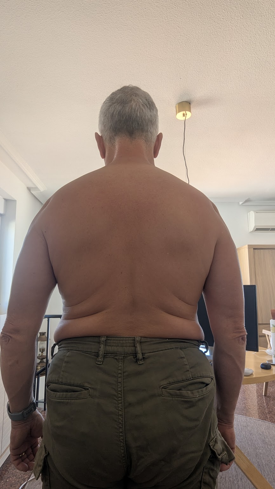
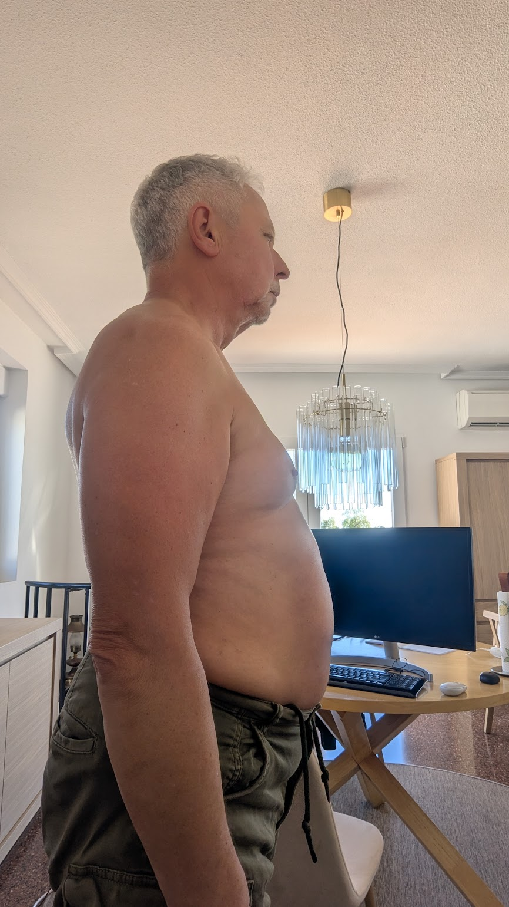
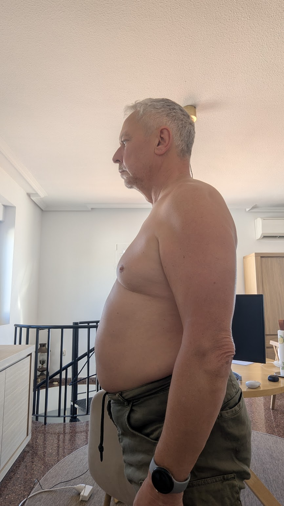

- #Health
	- #Morning
		- wood:: On
		- #Photos
			- {:width 250}
			- {:width 250} {:width 250}
			- {:width 250} {:width 250}
				- https://photos.fife.usercontent.google.com/pw/AP1GczNj0FC1tx5BsF-j8sRx7JncwOsInyK1Qt9il-KIph9tKjCBbYmQy97E1w=w866-h1539-s-no-gm?authuser=0
- #House
	- Took apart the water boiler. It is full of limescale and I need to replace it
-